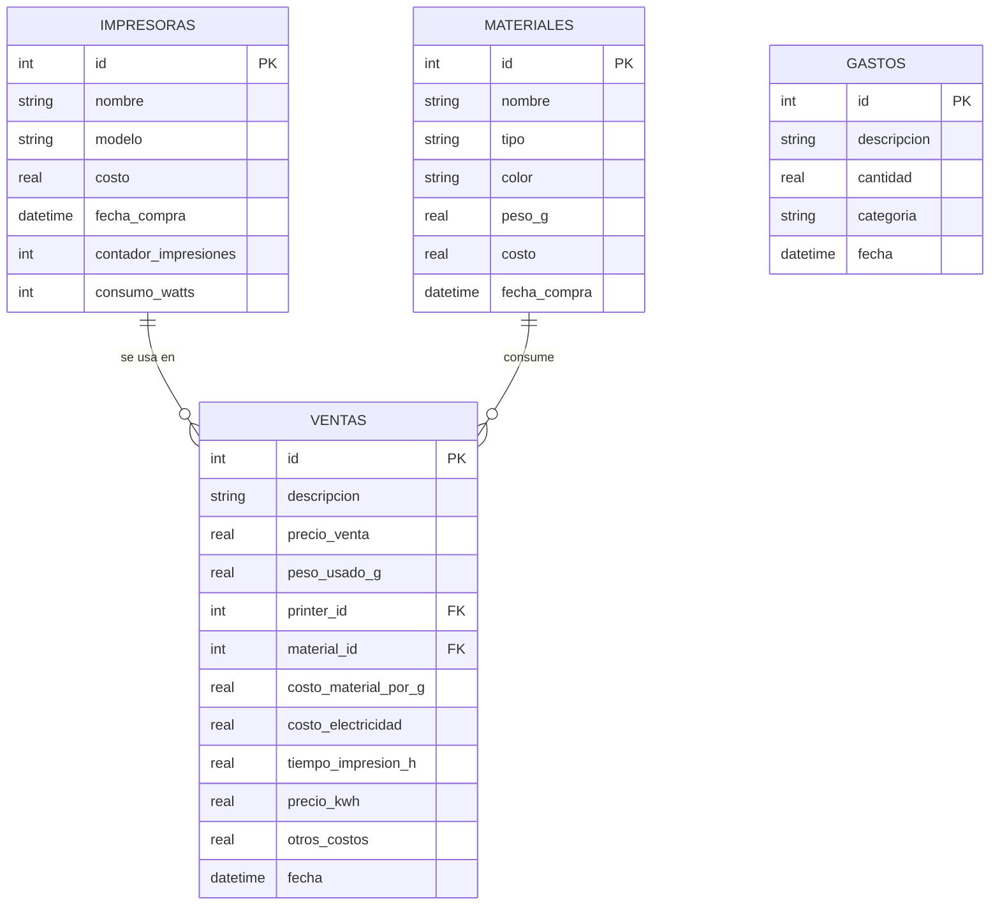

# 🗄️ Esquema de Base de Datos

Este documento detalla la estructura de la base de datos SQLite utilizada en el **Gestor de Impresión 3D**.

La base de datos se almacena localmente en el archivo `impresoras_materiales.db`.

---

## 🗺️ Diagrama Lógico de Tablas

---

## 📑 Detalle de Tablas

### 1. `impresoras`
Almacena la información de las máquinas disponibles.

| Columna | Tipo | Descripción |
| :--- | :--- | :--- |
| `id` | INTEGER (PK) | Identificador único autoincremental. |
| `nombre` | TEXT | Apodo o etiqueta para identificar la máquina. |
| `modelo` | TEXT | Marca y modelo técnico. |
| `costo` | REAL | Inversión inicial realizada en la máquina. |
| `fecha_compra` | TEXT | Fecha de adquisición (ISO 8601). |
| `contador_impresiones` | INTEGER | Histórico de trabajos enviados a esta máquina. |
| `consumo_watts` | INTEGER | Consumo eléctrico nominal para cálculos de costo. |

### 2. `materiales`
Gestión del inventario de insumos.

| Columna | Tipo | Descripción |
| :--- | :--- | :--- |
| `id` | INTEGER (PK) | Identificador único autoincremental. |
| `nombre` | TEXT | Nombre del material o fabricante. |
| `tipo` | TEXT | PLA, PETG, ABS, Resina, etc. |
| `color` | TEXT | Color del material. |
| `peso_g` | REAL | **Stock actual** en gramos. |
| `costo` | REAL | Precio pagado por la unidad de material. |
| `fecha_compra` | TEXT | Fecha de recepción del material. |

### 3. `ventas`
Registro de trabajos realizados y sus costos asociados.

| Columna | Tipo | Descripción |
| :--- | :--- | :--- |
| `id` | INTEGER (PK) | Identificador único. |
| `descripcion` | TEXT | Detalle del trabajo o nombre del cliente. |
| `precio_venta` | REAL | Ingreso bruto por el trabajo. |
| `peso_usado_g` | REAL | Gramos consumidos (restados de `materiales.peso_g`). |
| `printer_id` | INTEGER (FK) | Relación con la tabla `impresoras`. |
| `material_id` | INTEGER (FK) | Relación con la tabla `materiales`. |
| `costo_material_por_g` | REAL | Instantánea del costo del material en el momento del registro. |
| `costo_electricidad` | REAL | Valor calculado: `tiempo` x `consumo` x `precio KWh`. |
| `tiempo_impresion_h` | REAL | Horas totales de funcionamiento. |
| `precio_kwh` | REAL | Precio de la energía en el momento del cálculo. |
| `otros_costos` | REAL | Costos fijos o extras añadidos al trabajo. |
| `fecha` | TEXT | Fecha de finalización/registro. |

### 4. `gastos`
Gastos generales de mantenimiento y operación.

| Columna | Tipo | Descripción |
| :--- | :--- | :--- |
| `id` | INTEGER (PK) | Identificador único. |
| `descripcion` | TEXT | Concepto del gasto. |
| `cantidad` | REAL | Importe pagado. |
| `categoria` | TEXT | Clasificación (Herramientas, Repuestos, Servicios, etc.). |
| `fecha` | TEXT | Fecha del movimiento económico. |

---

## 🔒 Reglas de Integridad

- **Cascada en Borrado:** Si se elimina una impresora o material, las ventas asociadas se eliminan en cascada (`ON DELETE CASCADE`) para evitar registros huérfanos.
- **Transaccionalidad:** Los procesos de actualización de stock e incremento de contadores se realizan de forma atómica para garantizar la coherencia de los datos.
